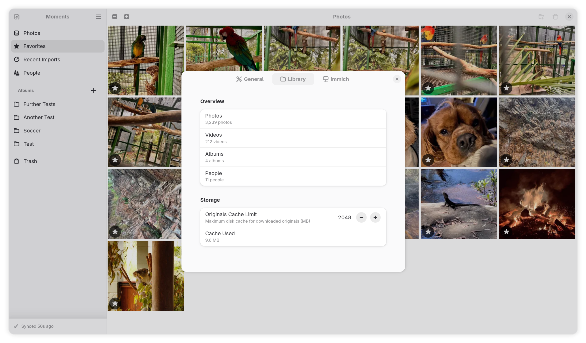

# Moments

A photo management application for the GNOME desktop. Organize, browse, and manage your photo library with support for local storage and [Immich](https://immich.app/) servers.

## Features

- **Local and Immich backends** — manage photos stored on your filesystem or connect to an Immich server for cloud-based library management
- **Offline-first sync** — the Immich backend caches everything locally in SQLite, so the app works fully offline and syncs when connected
- **Fast grid browsing** — keyset-paginated photo grid with six zoom levels and smooth scrolling through large libraries
- **RAW format support** — import and display CR2, NEF, ARW, DNG, and other RAW formats alongside standard JPEG, PNG, WebP, HEIC, and TIFF
- **Video support** — import and play video files with GStreamer-based playback
- **Albums** — create and manage albums to organize your photos
- **People** — browse photos by person using face data synced from Immich
- **Favourites and filtering** — star your best photos and filter by favourites, recent imports, or trash
- **EXIF metadata** — view camera, lens, exposure, GPS, and other metadata in the detail panel

## Screenshots




## Installation

Moments is distributed as a Flatpak. There is no Flathub listing yet — for now, build from source.

### Building from Source

**Requirements:**

- [GNOME Builder](https://apps.gnome.org/Builder/) (recommended), or
- `flatpak-builder` and the GNOME SDK

**Using GNOME Builder:**

1. Clone the repository:
   ```bash
   git clone https://github.com/justinf555/Moments.git
   cd Moments
   ```
2. Open the project in GNOME Builder
3. Click **Run** (or press <kbd>Ctrl</kbd>+<kbd>F5</kbd>)

**Using the command line:**

```bash
git clone https://github.com/justinf555/Moments.git
cd Moments
make run
```

This builds and installs the Flatpak locally, then launches the app.

### System Dependencies (for `cargo test` outside Flatpak)

If you want to run unit tests directly, you need these system libraries:

- `gtk4-devel`
- `libadwaita-devel`
- `gettext-devel`
- `libheif-devel`
- `gstreamer1-devel` and `gstreamer1-plugins-base-devel`
- `libsecret-devel`

On Fedora:
```bash
sudo dnf install cargo gtk4-devel libadwaita-devel gettext-devel \
  libheif-devel gstreamer1-devel gstreamer1-plugins-base-devel \
  libsecret-devel pkg-config
```

Then run:
```bash
cargo test
```

## Contributing

Contributions are welcome! Please read [CONTRIBUTING.md](CONTRIBUTING.md) for guidelines on reporting bugs, suggesting features, and submitting pull requests.

For an overview of the codebase, see [ARCHITECTURE.md](ARCHITECTURE.md).

## Getting in Touch

- [GitHub Issues](https://github.com/justinf555/Moments/issues) — bug reports and feature requests
- [GitHub Discussions](https://github.com/justinf555/Moments/discussions) — questions and general discussion

## License

Moments is licensed under the [GNU General Public License v3.0 or later](COPYING).
