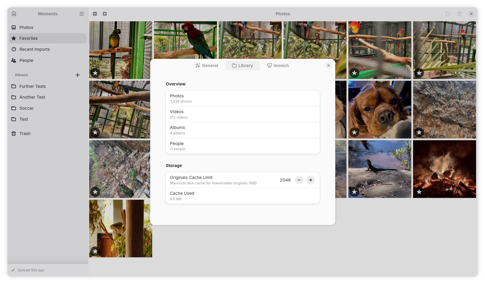

# Moments

A photo management application for the GNOME desktop. Organize, browse, and manage your photo library with support for local storage and [Immich](https://immich.app/) servers.

## Features

- **Local and Immich backends** — manage photos stored on your filesystem or connect to an Immich server for cloud-based library management
- **Offline-first sync** — the Immich backend caches everything locally in SQLite, so the app works fully offline and syncs when connected
- **Fast grid browsing** — keyset-paginated photo grid with six zoom levels and smooth scrolling through large libraries
- **RAW format support** — import and display CR2, NEF, ARW, DNG, and other RAW formats alongside standard JPEG, PNG, WebP, HEIC, and TIFF
- **Video support** — import and play video files with GStreamer-based playback
- **Albums** — create and manage albums to organize your photos
- **People** — browse photos by person using face data synced from Immich
- **Favourites and filtering** — star your best photos and filter by favourites, recent imports, or trash
- **EXIF metadata** — view camera, lens, exposure, GPS, and other metadata in the detail panel

## Screenshots




## Installation

Moments is distributed as a Flatpak. There is no Flathub listing yet — install the
bundle attached to a [GitHub Release](https://github.com/justinf555/Moments/releases),
or build from source.

### From a release bundle

Every release ships a single-file `.flatpak` bundle. Download
`moments-<version>-x86_64.flatpak` from the
[latest release](https://github.com/justinf555/Moments/releases/latest) and install it:

```bash
flatpak install --user moments-<version>-x86_64.flatpak
flatpak run io.github.justinf555.Moments
```

Moments needs the GNOME 50 runtime. The bundle points at Flathub as its runtime
source, so Flatpak offers to add that remote and pull the runtime if you don't have
it yet.

Bundles are installed as a one-off, so `flatpak update` won't pick up new versions —
download and install the next bundle the same way.

**Verifying the download.** Each release also carries a `.sha256` file:

```bash
sha256sum -c moments-<version>-x86_64.flatpak.sha256
```

Signed releases additionally include `moments-releases.asc`, the public key the
bundle was signed with. The GPG signature and a copy of that key travel inside the
bundle itself, so the install is trust-on-first-use — the published key is there so
the signing identity is a matter of record and stays stable across releases:

```bash
gpg --show-keys moments-releases.asc    # fingerprint of the release signing key
```

### Building from Source

**Requirements:**

- [GNOME Builder](https://apps.gnome.org/Builder/) (recommended), or
- `flatpak-builder` and the GNOME SDK

**Using GNOME Builder:**

1. Clone the repository:
   ```bash
   git clone https://github.com/justinf555/Moments.git
   cd Moments
   ```
2. Open the project in GNOME Builder
3. Click **Run** (or press <kbd>Ctrl</kbd>+<kbd>F5</kbd>)

**Using the command line:**

```bash
git clone https://github.com/justinf555/Moments.git
cd Moments
make run
```

This builds and installs the Flatpak locally, then launches the app.

**Building your own bundle:**

```bash
make bundle           # → moments-<version>-<arch>.flatpak (+ .sha256)
make install-bundle   # build if needed, then flatpak install --user
```

`make bundle` builds the production app ID from the working tree and packs it into a
redistributable single-file bundle — the same command the release workflow runs. Pass
`GPG_KEY=<key-id>` (optionally `GPG_HOMEDIR=<dir>`) to sign it.

### System Dependencies (for `cargo test` outside Flatpak)

If you want to run unit tests directly, you need these system libraries:

- `gtk4-devel`
- `libadwaita-devel`
- `gettext-devel`
- `libheif-devel`
- `gstreamer1-devel` and `gstreamer1-plugins-base-devel`
- `libsecret-devel`

On Fedora:
```bash
sudo dnf install cargo gtk4-devel libadwaita-devel gettext-devel \
  libheif-devel gstreamer1-devel gstreamer1-plugins-base-devel \
  libsecret-devel pkg-config
```

Then run:
```bash
cargo test
```

## Experimental features

Moments ships with non-destructive **rotate**, **flip**, and **crop**
enabled by default. The pixel-adjustment and filter editing sections
ship in the binary but are hidden by default while they get more
real-world testing miles. You can opt in per-feature via GSettings.

Because Moments is a sandboxed Flatpak with no dconf hole, run
`gsettings` *inside* the sandbox with `flatpak run --command=gsettings`:

```bash
# Enable the Adjustments section (exposure, contrast, saturation,
# temperature, tint, vignette).
flatpak run --command=gsettings io.github.justinf555.Moments \
    set io.github.justinf555.Moments enable-adjustments true

# Enable the Filters section (Noir, Sepia, B&W).
flatpak run --command=gsettings io.github.justinf555.Moments \
    set io.github.justinf555.Moments enable-filters true
```

Restart Moments after changing either key. To revert, replace `set`
with `reset` and drop the trailing value.

For development builds (`make run-dev`, app id
`io.github.justinf555.Moments.Devel`), substitute that app id in both
positions (the `flatpak run` target *and* the schema id).

## Contributing

Contributions are welcome! Please read [CONTRIBUTING.md](CONTRIBUTING.md) for guidelines on reporting bugs, suggesting features, and submitting pull requests.

For an overview of the codebase, see [ARCHITECTURE.md](ARCHITECTURE.md).

## Getting in Touch

- [GitHub Issues](https://github.com/justinf555/Moments/issues) — bug reports and feature requests
- [GitHub Discussions](https://github.com/justinf555/Moments/discussions) — questions and general discussion

## License

Moments is licensed under the [GNU General Public License v3.0 or later](COPYING).
